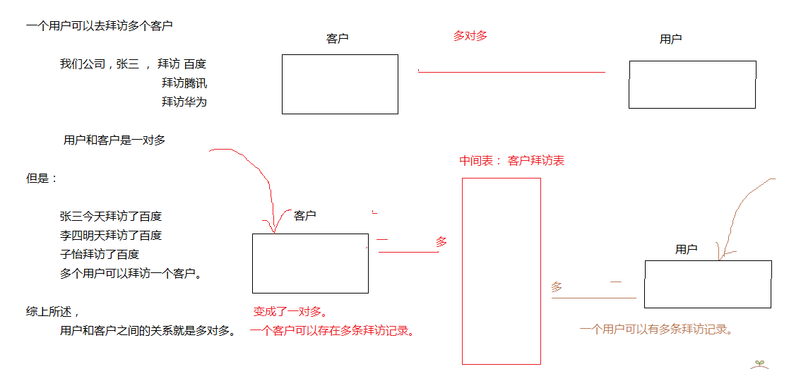
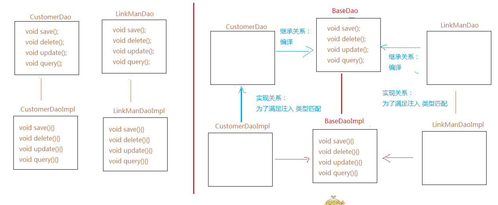

##一、联系人筛选

* web

> 普通的文本框都比较简单，只有在过滤所属客户稍微难点，我们要先获取到所有的客户数据下来，然后放置在下拉框里面，供用户选择过滤。

		<TD>所属客户：</TD>
		<TD>
			<select name="customer.cust_id" id="customer"  class=textbox style="WIDTH: 100px;height:21px">
				<option value="">--请选择--</option>
			</select>
		</TD>
	

		异步获取所有客户数据下来：

		$(function (){
			var url = "${pageContext.request.contextPath}/customer_findAll.action";
			$.post(url ,  function(result){
				$(result).each(function(i , n){
					$("#customer").append("<option value='"+n.cust_id+"'>"+n.cust_name+"</option>");
				});
			} , "json");
		})
* action
>在action执行这些数据校验，以便给离线对象添加查询条件

	public String findByPage(){
		
		DetachedCriteria criteria = DetachedCriteria.forClass(LinkMan.class);
		
		
		//校验联系人名称
		if(!StringUtils.isEmpty(linkMan.getLkm_name())){
			criteria.add(Restrictions.like("lkm_name", "%"+linkMan.getLkm_name()+"%"));
		}
		//校验联系人电话
		if(!StringUtils.isEmpty(linkMan.getLkm_phone())){
			criteria.add(Restrictions.like("lkm_phone", "%"+linkMan.getLkm_phone()+"%"));
		}
		//校验联系人qq
		if(!StringUtils.isEmpty(linkMan.getLkm_qq())){
			criteria.add(Restrictions.like("lkm_qq", "%"+linkMan.getLkm_qq()+"%"));
		}
		//校验联系人邮箱
		
		if(!StringUtils.isEmpty(linkMan.getLkm_email())){
			criteria.add(Restrictions.like("lkm_email", "%"+linkMan.getLkm_email()+"%"));
		}
		
		//校验联系人的性别
		if(!StringUtils.isEmpty(linkMan.getLkm_gender())){
			criteria.add(Restrictions.eq("lkm_gender", linkMan.getLkm_gender()));
		}
		
		//校验联系人所属客户
		if(linkMan.getCustomer()!= null && !StringUtils.isEmpty(linkMan.getCustomer().getCust_id())){
			criteria.add(Restrictions.eq("customer.cust_id", linkMan.getCustomer().getCust_id()));
		}
		
		PageBean<LinkMan> pageBean = linkManService.findByPage(criteria , currentPage , pageSize);
		
		//push | set |成员变量 （属性）
		ActionContext.getContext().getValueStack().push(pageBean);
		
		return Constants.PAGE_SUCCESS;
	}

> service 和 Dao其实就是以前的分页查询的代码，我们做筛选仅仅是在action这个阶段，添加筛选条件即可，下面两层的代码和以前一样，这里就不给出来了。

##二、删除联系人

* web

		<a href="javascript:del(${lkm_id})">删除</a>

		function del(id){
			var flag = confirm("确定删除该联系人吗?");
			if(flag){
				location.href="${pageContext.request.contextPath}/linkMan_delete?lkm_id="+id;
			}
		}
	
* action

	
		public String delete(){
			linkManService.delete(linkMan);
			return Constant.DELETE_SUCCESS;
		}

* service :

		@Override
		public void delete(LinkMan linkMan) {
			linkManDao.delete(linkMan);
		}

* dao

		@Override
		public void delete(LinkMan linkMan) {
			getHibernateTemplate().delete(linkMan);
		}

##三、联系人修改

* 思路分析：

	1. 获取到联系人数据
	
	2. 把数据存储到值栈

* action代码

		private LinkMan editLinkMan ;
		public LinkMan getEditLinkMan() {
			return editLinkMan;
		}

		//该方法是更新的第一步，仅仅是查询数据而已
		public String edit(){

			//采用属性方式，存储值到值栈
			editLinkMan = linkManService.findById(linkMan.getLkm_id());
			return Constants.EDIT_SUCCESS;
		}
		
		//更新的第二步，完成更新操作
		public String update(){
			linkManService.update(linkMan);
			return Constants.UPDATE_SUCCESS;
		}

> service  & dao的代码就不给出了，和以前的代码基本相似。 注意： 如果使用属性方式存值到值栈，那么取值收到和set方式是一样的。

##四、客户拜访

* 建表分析

> 客户拜访表其实就是用来记录了，用户和 客户之间谈话的信息。 一个客户可以被多个用户拜访 。 一个用户可以去拜访多个客户。 

		百度：

			张三
			李四

		用户：

			张总
			李总

		用户和客户的关系其实就是多对多的关系。 那么一般表示多对多的关系，都需要中间的第三张表来维护。 也就是把多对多的关系，拆分成了两个一对多的关系。

###1、 持久化类&映射创建
	
* 持久化类
			private String visit_id; //主键ID
	
			
			private Date visit_time; //拜访时间
			private Date visit_nexttime; //下次拜访时间
			private String visit_addr; //拜访地址
			private String visit_detail; //拜访详情
			
				//1. 拜访的是哪一个客户
				private Customer customer;
				
				//2. 拜访的是哪一个联系人
				private LinkMan linkMan;
				
				//3. 谁去拜访了。
				private User user;
			

* 映射文件

		<class name="com.itheima.bean.SaleVisit" table="sale_visit">
			<id name="visit_id">
				<generator class="uuid"></generator>
			</id>
			<property name="visit_time"></property>
			<property name="visit_nexttime"></property>
			<property name="visit_addr"></property>
			<property name="visit_detail"></property>
			<!-- <property name="visit_interviewee"></property> -->
			
			
			<!-- 表示拜访的是哪一个客户 -->
			<many-to-one name="customer" column="visit_cust_id" class="com.itheima.bean.Customer"></many-to-one>
			
			<!-- 表示谁去拜访了这个客户 -->
			<many-to-one name="user" column="visit_user_id" class="com.itheima.bean.User"></many-to-one>
			
			
			<!-- 表示这个客户的哪一个联系人-->
			<many-to-one name="linkMan" column="visit_lkm_id" class="com.itheima.bean.LinkMan"></many-to-one>
		</class>	

###2、 添加客户拜访

* 页面的级联操作
> 页面需要表示出来，拜访了哪个客户的哪个联系人。所以我们需要查询出来所有的客户以供选取，并且联系人的选取也要依赖于我们选择了哪一个客户。 这和之前我们开始学习Jquery的省市级联操作一样。

1. 客户数据显示：

		获取客户数据： 

				$(function(){
				var url = "${pageContext.request.contextPath}/customer_findAllByAjax.action";
				$.get(url , function(result){
					
					$(result).each(function(i , n){
						//遍历一次，就追加一次 option
						$("#customer").append("<option value='"+n.cust_id+"'>"+n.cust_name+"</option>")
					})
				} , "json");
			})
			

			<td>客户名称：</td>
			<td><select name="customer.cust_id" id="customer"onchange="changeCustomer()" class="textbox"style="width: 180px; height: 21px;">
				<option value="">请选择</option>
			</select></td

> onChange属性给定的方法，即是我们选择了某一个客户后，就执行的方法。

		function changeCustomer(){
		
		//1. 先获取到底现在选择的是哪一个客户
		var id = $("#customer").val();
		var url = "${pageContext.request.contextPath}/linkMan_findByCustomerId.action"
		$.post(url , {customerId : id} , function(result){
			
			//在追加之前，先清空内容
			$("#linkman").html("<option value=''>请选择</option>");
			
			$(result).each(function(i , n ){
				$("#linkman").append("<option value='"+n.lkm_id+"'>"+n.lkm_name+"</option>");
			});
			
		} , "json");
		
	}

* 保存代码实现
		public String save(){
			
			User user = (User) ServletActionContext.getRequest().getSession().getAttribute("user");
			saleVisit.setUser(user);
			
			saleVisitService.save(saleVisit);
			
			return "save_success";
		}

###3、 列表显示客户拜访
> 基本上和之前的几个模块分页显示一致。

###4、 客户拜访筛选
		
	public String findByPage(){
		DetachedCriteria criteria = DetachedCriteria.forClass(SaleVisit.class);
		
		//客户名称判定
		if(saleVisit.getCustomer() != null  && !StringUtils.isEmpty(saleVisit.getCustomer().getCust_id())){
			criteria.add(Restrictions.eq("customer.cust_id", saleVisit.getCustomer().getCust_id()));
		}
		
		//起止时间判定
		
		if(start_visit_time!= null  &&  end_visit_time != null){
			criteria.add(Restrictions.between("visit_time", start_visit_time, end_visit_time));
		}else{
			
			//也许两个都没有， 也许只有一个。
			
			if(start_visit_time != null ){
				criteria.add(Restrictions.ge("visit_time", start_visit_time));
			}else if(end_visit_time != null ){
				criteria.add(Restrictions.le("visit_time", end_visit_time));
			}
			
		}
		
		
		
		pageBean = saleVisitService.findByPage(criteria , currentPage , pageSize);
		
		for (SaleVisit sv : pageBean.getList()){
			
			System.out.println(sv.toString());
		}
		
		return "page_success";
	}
	
> 列表显示客户拜访的前端代码，和以前的客户 & 联系人一样。

###5. 日期格式转化

> 页面上显示拜访的日期格式太乱了，还包含了毫秒数， 如果需要修改时间显示的格式，需要使用struts提供的类型转化器思路。

####1. 定义自己的类型转化器

		public class DateConverter extends StrutsTypeConverter {
			SimpleDateFormat format = new SimpleDateFormat("yyyy年MM月dd日");
		
			
			//从页面收到数据之后，使用这个方法来转化数据 values 就是收到的页面数据
			@Override
			public Object convertFromString(Map context, String[] values, Class toClass) {
				
				try { 
					//2017-08-11
					String value = values[0];
					return format.parse(value);
				} catch (ParseException e) {
					e.printStackTrace();
				}
				return null;
			}
		
			
			//返回数据给页面，经过这个方法转化 o： 就是即将要丢给页面的数据
			@Override
			public String convertToString(Map context, Object o) {
				return format.format(o);
			}
		
		}

####2. 使用转化器

> 在src底下新建一个properties文件，名字必须是： xwork-conversion.properties 

 内容为： java.util.Date=com.itheima.util.DateConverter

####3. 注意：页面取值需要使用struts标签才能显示转化过后的时间

	
	<s:property value="#visit.visit_time"/>

##五、BaseDao抽取

###1. 实现了四个模块 ， 客户模块 、 联系人模块、客户拜访模块 、 系统用户模块 ， 通过观察发现，这些dao的实现里面，都存在 增删该查的方法，并且相似度很高。

		save();
	
		update();
	
		delete();
	
		findAll();
	
		-----------------------------
		findByPage()
	
		findById();
	
		findCount();

###2、BaseDao抽取

		
	public interface BaseDao<T> {
	
		// 保存
		void save(T t);
	
		// 删除
		void delete(T t);
	
		// 删更新
		void update(T t);
		
		// 查询所有
		List<T> findAll();
		
		
		//根据ID查询
		T findById(Serializable id); 
		
		//查询总数
		int findCount(DetachedCriteria criteria);
		
		//分页查询
		List<T> findByPage(DetachedCriteria criteria , int currentPage , int pageSize);
		
	}

###3、BaDaoImpl实现

> 实现代码和以前一样，只不过是换了一个类而已。

###4. BaseDaoImpl 获取具体的查询类型
> 使用构造方法获取，这要求，子类必须调用父类的有参构造，然后传递进来具体的class

	private Class clazz;
	public BaseDaoImpl(Class clazz){
		this.clazz = clazz;
	}

	如： 

		public Class CustomerDaoImpl extends BaseDaoImpl implement CustomerDao{

			public  CustomerDaoImpl(){
				super(Customer.class);
			}
		}

###5. BaseDaoImpl 反射获取泛型类型

	private Class clazz;
	/*public BaseDaoImpl(Class clazz){
		this.clazz = clazz;
	}*/
	
	public BaseDaoImpl(){
		//在无参构造方法里面，获取子类上面的泛型具体的类型是什么。   
		//真正意义上取的并不是子类的那个泛型类型是什么，而是现在这个BaseDaoImpl上面的T是什么类型
		
		//如果获取父类上面的泛型是什么类型
		
		
		//这里this : CustomerDaoImpl的实例对象
		//this.getClass : 得到的是子类的字节码CustomerDaoImpl
		//this.getClass().getGenericSuperclass() ： 得到的父类的字节码  BaseDaoImpl<T>
		//但是现在这个T已经不是T 了，而是子类传递过来的Customer 
		Type type = this.getClass().getGenericSuperclass();
		
		//如果现在这种type 属于这个 ParameterizedType 带有参数的类型
		if(type instanceof ParameterizedType){
			
			// BaseDaoImpl<Customer>
			ParameterizedType  pType = (ParameterizedType) type;
			
			//这个方法是获取泛型上面的真实类型是什么， 由于子类可能会传递过来泛型过来，所以0代表只取第一个泛型类型。
			clazz = (Class) pType.getActualTypeArguments()[0];
		}
		
	}

###6. 思路过程

1. 定义一个BaseDao  声明CRUD方法 

2. 定义一个BaseDaoImpl 实现了BaseDao

3. CustomerDaoImpl 继承BaseDaoImpl

		public Class CustomerDaoImpl extends BaseDaoImpl{} 
	
		如果只是这么写，是无法启动的。因为我们在CustomerServiceImpl里面需要注入一个CustomerDao customerDao 这种类型。 但是CustomerDaoImpl 跟CustomerDao 一点关系都没有。所以为了能够让他们注入成功。必须也让CustomerDaoImpl 实现CustomerDao

4. CustomerDaoImpl 继承 BaseDaoImpl  实现CustomerDao

		public Class CustomerDaoImpl extends BaseDaoImpl implements CustomerDao{

		} 

		public interface CustomerDao{
			
		}
		
	如果只是这样也会有问题：  在业务逻辑层里面有这样的代码存在  customerDao.save() cusotmerDao.delete()

	但是在编译的时候，就会去CustomerDao这个接口里面找有没有这两个方法呢。 实际上并没有。 所以必须让这个CustomerDao 和 BaseDao 也存在关系。
